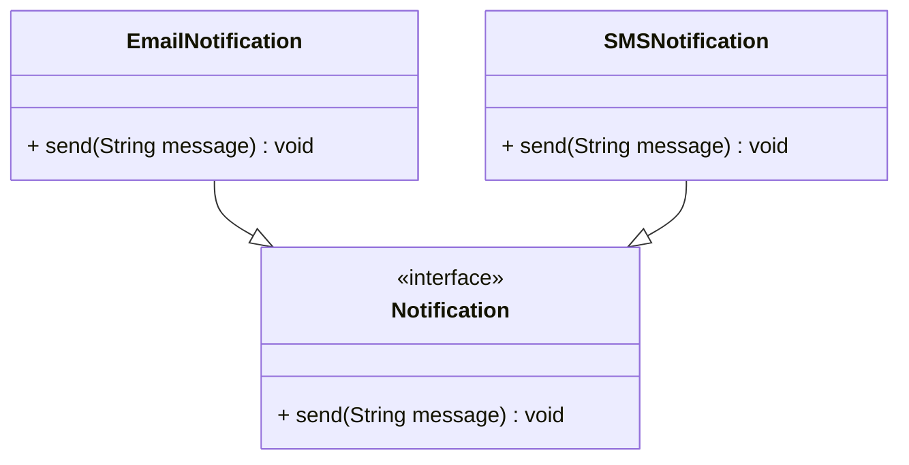
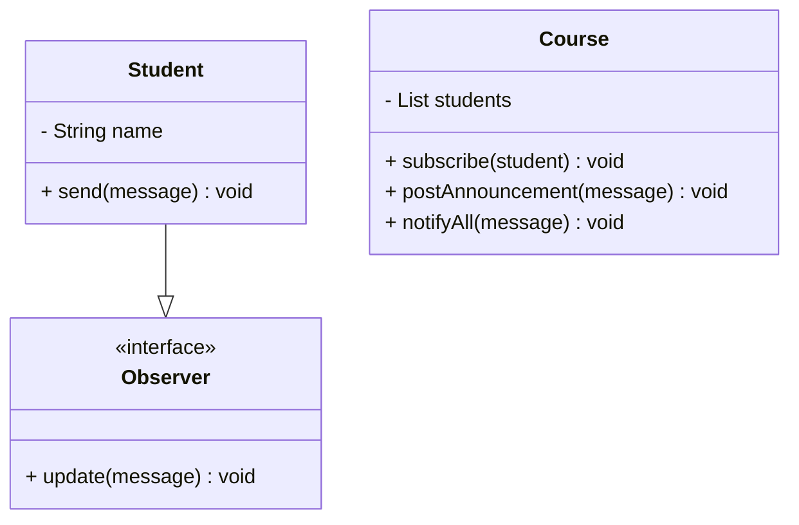
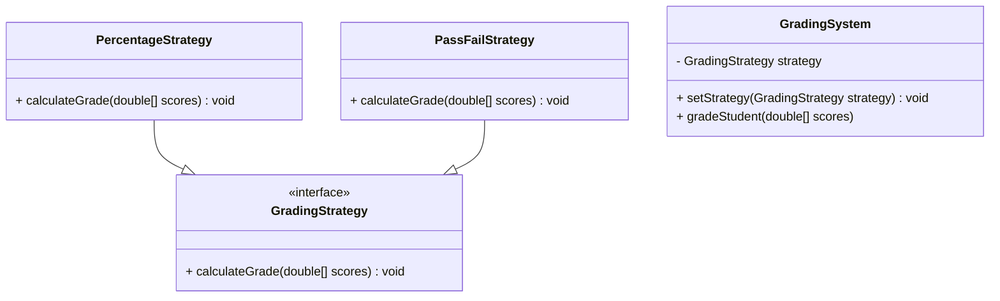
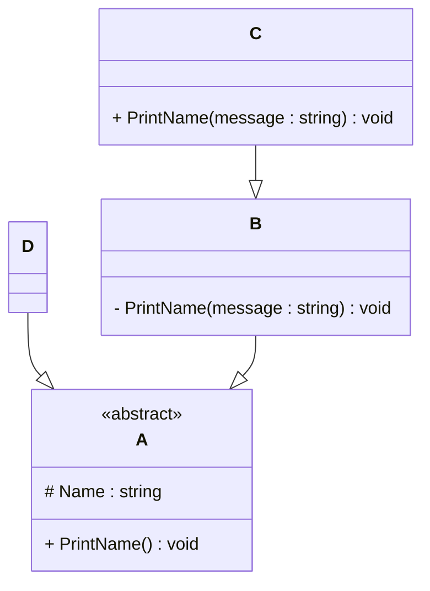

# Programming Test

This test was composed to create a general overview of your knowledge regarding general programming and how it fits with the needs in our lab. Please try to answer all questions using your own knowledge and in your own words. If you get stuck on one of the exercises, still try to give a short answer.

---

## Exercise 1

### Task
Write a program in the language of your choice where:

1. The iteration number (starting from 1), followed by a random number between 1 and 100, is printed 100 times.
2. After every 5 iterations, write an additional separator (e.g., `---`).
3. Write “Lucky number!” after every random number that is divisible by 7.

> Try to keep the procedure as short as possible.

```javascript
for (let i = 1; i <= 100; i++) {
    const rand_int = Math.floor(Math.random() * 100 + 1);
    console.log(`${rand_int} ${rand_int % 7 === 0 ? "Lucky number!" : ""}`);
    i % 5 === 0 && console.log("---")
}
```
---

## Exercise 2

### 1. **What is your understanding of the term “Design Patterns”?**  
   Provide a description in your own words.

It is reusable solutions to common problems in software design.
They are not finished code, but best practices that guide how to organize and structure code in flexible and scalable way.
Design patterns help to solve common programming problems more efficiently and clearly communicate design choices to team members.

### 2. **Explain the MVC Pattern**  
   - What does MVC stand for?  
   - Explain the pattern in detail.  
   - What are some use cases for this framework?

MVC stands for Model-View-Controller.
This pattern used in software development to separate the logic of application into 3 main components.
- The Model handles the data and business logic
- The View is responsible for what the user sees
- The Controller acts as middleman, which receives input from user via the View, processes it and returns the result back to the View

For example, user clicks the button (he interacts with View).
The Controller receives the input and decides what to do.
The Controller can update the Model if needed.
After that the View updates based on the latest data from the Model.

It can be used:

- in web applications (for example, Django, Laravel, Ruby)
- desktop applications (JavaScript, .NET)
- Mobile apps
- Game development (to separate game logic, UI, and input handling)

### 3. **List three other design patterns**  
   - Provide names and details for three additional design patterns.
   - Explain how you have used those patterns in the past and how they have solved your problem  
   - Use diagrams to explain the design patterns.

#### Factory Method

It provides an interface for creating objects but lets the implementation decide which class to instantiate. 
It allows for the creation of objects without specifying the exact class in the client code. This improves flexibility and makes it easier to manage changes or extensions.

I used the Factory Pattern in a notification system where users could choose how they wanted to receive messages: from Email or SMS.
Instead of instantiating each type manually, I used this pattern.

```java 
interface Notification {
    void send(String message);
}

class EmailNotification implements Notification {
    public void send(String message) {
        System.out.println("Sending EMAIL: " + message);
    }
}

class SMSNotification implements Notification {
    public void send(String message) {
        System.out.println("Sending SMS: " + message);
    }
}

class NotificationFactory {
    public static Notification createNotification(String type) {
        switch (type.toLowerCase()) {
            case "email": return new EmailNotification();
            case "sms": return new SMSNotification();
            case "push": return new PushNotification();
            default: throw new IllegalArgumentException("Unknown type: " + type);
        }
    }
}
```

This centralized the creation logic and made it easy to later introduce new types without changing existing code.

#### Observer Pattern

It allows one object to notify other objects automatically when its state changes.

I used this pattern while building a university course program as university project.
In my example, a Course notifies all enrolled Student objects when a new announcement is posted.
Here is a small piece of code with Observer Pattern implementation:

```java
class Observer {
    <<interface>>
	+ update(String message) void
}

class Student {
	- String name
	+ update(String message) void
}

class Course {
	- List<Observer> students
	+ subscribe(Observer student) void
	+ postAnnouncement(String message) void
	+ notifyAllObservers(String message) void
}

Student --|> Observer
```



In this example Students subscribe using subscribe(), and when postAnnouncement() is called, the course notifies all observers by calling their update() method. 
This allows automatic notifications without tight coupling between objects.

#### Strategy pattern

This pattern allows to define a family of algorithms, put them in separate classes and switch between them at runtime.
It lets the behavior of a class be selected at runtime without changing its structure.

I used Strategy pattern in university grading system, in which different courses may use different grading methods: 
percentage-based grading,  pass/fail grading.

```java
interface GradingStrategy {
    String calculateGrade(double[] scores);
}

class PercentageStrategy implements GradingStrategy {
    @Override
    public String calculateGrade(double[] scores) {
        double avg = (scores[0] + scores[1]) / 2;
        return "Grade: " + avg + "%";
    }
}

class PassFailStrategy  implements GradingStrategy {
    @Override
    public String calculateGrade(double[] scores) {
        double avg = (scores[0] + scores[1]) / 2;
        return avg >= 50 ? "Pass" : "Fail";
    }
}

class GradingSystem {
    private GradingStrategy strategy;

    public void setStrategy(GradingStrategy strategy) {
        this.strategy = strategy;
    }

    public void gradeStudent(double[] scores) {
        System.out.println(strategy.calculateGrade(scores));
    }
}
```


Using the Strategy Pattern, each grading method is implemented as a separate strategy, and the system can choose the appropriate one dynamically.
This approach allows clean separation of grading logic, you can easily add or modify grading rules without changing the system.

---

## Exercise 3

### 1. **Implementation Task**  
   Based on the class diagram below, provide an implementation in any object-oriented programming language of your choice.
   


```java 
abstract class A {
    protected String Name;

    public A(String name) {
        this.Name = name;
    }

    public abstract void PrintName();
}

class B extends A {
    public B(String name) {
        super(name);
    }

    private void PrintName(String message) {
        System.out.println(message + ": " + Name);
    }

    @Override
    public void PrintName() {
        PrintName("From B Class");
    }
}

class C extends B {
    public C(String name) {
        super(name);
    }

    public void PrintName(String message) {
        System.out.println(message + ": " + Name);
    }
}

class D extends A {
    public D(String name) {
        super(name);
    }

    @Override
    public void PrintName() {
        System.out.println("From D Class");
    }
}
```

### 2. **Key Questions**  
   - Are you able to directly create a new instance of `ObjectA`? Please explain your answer.  
   - Given an instance of `ObjectC`, are you able to call the method `PrintMessage` defined in `ObjectB`? Please explain your answer.  
   - Try to explain as many key features of object-oriented programming as you can find in this example.

**Answers:**

1. No, you cannot directly create a new instance of `ObjectA`, because they may contain incomplete or undefined methods that must be implemented by subclasses.
But you can create an anonymous subclass, which implements `ObjectA`, and then instantiate that subclass.
<br>For example:
```java 
final A a1 = new A("Name") {
    @Override
    public void PrintName() {
        System.out.println('A');
    }
};
a1.PrintName();
```

2. Yes, you are able to call the method `PrintName()` defined in class B, because class C inherits from B, and thus it also inherits the public method `PrintName()`.
However, you cannot directly call `PrintName(String message)` from outside B, because it is marked as private and accessible only within class B.

3. - **Abstraction**
<br>
The abstract class A defines a general concept of something that has a `Name` field and method `PrintName()` without implementing it.
This forces all subclasses of A to provide a concrete implementation of `PrintName()`
<br>It allows to hide implementation details and expose only essential features.
<br>
   - **Inheritance**
<br>
Class B and D extend A, which means that it inherits the `Name` field and abstract method `PrintName()`, which it must implement.
Class C extends B, and thus indirectly extends A as well.
<br>It allows to reuse the code and creates hierarchical relationship between classes.
   - **Encapsulation**
<br>
The `Name` field is protected, which means it can be accessible in A and all subclasses, but not outside these classes.
<br>The method `PrintName()` is private, so it is hidden from all other classes, even subclasses.
<br>This approach limits access to internal details and exposes only what is necessary.
<br>
   - **Polymorphism**
<br>
You can refer to any subclasses using a reference of A and call `PrintName()`:
`java 
A obj = new C("Test");
obj.PrintName();
`
<br> Same interface, different implementations.
<br>
   - **Method Overriding**
<br>
B and D override the abstract method `PrintName()` from A and provide its own logic.
It allows to customize or extend behavior of base class methods.

---

## Exercise 4

### Maintaining and Expanding Software for Component Validation

This exercise focuses on strategies for working with existing code bases and ensuring the software remains maintainable as new features and requirements are introduced.

### 1. **Working with Existing Code**  
- How would you approach understanding and contributing to an existing code base with minimal disruption?  
<br>
**Answer:**
I would start by reading the documentation and running the project to see how it works.
Then, I would explore the code to understand the structure and how the main features are implemented.
Before making any changes, I’d discuss them with the team to make sure I’m on the right way.
I would also follow the existing code style and test everything carefully to avoid breaking anything.
<br>
<br>
- What practices would you follow to ensure your changes integrate well with the current structure?  
  <br>
**Answer:** I would follow the existing coding style and naming conventions, and keep the architecture consistent with how similar features are already implemented. 
I would carefully read and follow any contribution or development guidelines provided by the project. 
Before making changes, I’d try to understand the purpose and dependencies of the affected code, and aim to keep my updates small, focused, and easy to review. 
I would write or update tests as needed to verify that everything works correctly and doesn’t break existing functionality. 
Finally, I would review my changes and include clear commit messages or pull request descriptions to help others understand the reasoning behind them.

### 2. **Ensuring Maintainability**  
- What techniques would you use to keep the code base clean, modular, and easy to maintain as new features are added?  
<br>
**Answer:**
I would apply principles like separation of concerns and single responsibility.
I would break complex logic into smaller, reusable functions or classes and avoid duplicating code by using common utilities or modules.
Writing clear comments, meaningful commit messages, and keeping documentation up to date also helps with maintainability. 
Additionally, I’d use version control effectively, write tests for new code, and refactor regularly to improve structure as the project grows.
<br>
<br>
- How would you handle code documentation and testing to support long-term maintainability?  
<br>
**Answer:**
I would write clear, concise documentation alongside the code, including comments that explain why something is done, not just what it does. 
For larger components or complex logic, I’d include short summaries at the top of files or functions to guide future developers. 
I’d also keep README files or internal docs updated with setup steps, key workflows, and architectural decisions.
For testing, I’d aim for good coverage using unit tests for individual functions and integration tests for how components work together.
I’d write tests as part of feature development, not afterward, to ensure code is reliable from the start.

### 3. **Balancing Flexibility and Stability**  
- How would you design or refactor the software to make it flexible for future changes while ensuring the existing functionality remains stable?
<br>
**Answer:**
I’d break the system into smaller, well-defined modules so that future changes in one area don’t affect others. 
When refactoring, I’d avoid changing multiple things at once—instead, I’d take small, incremental steps and verify each one with tests.
I’d rely on existing tests and add new ones where coverage is missing to ensure current features stay stable.
I’d also use version control to isolate changes and allow easy rollback if needed.
<br>
<br>
- Which design patterns or principles would you apply to achieve this balance
<br>
**Answer:**
To achieve a balance between flexibility for future changes and stability of existing functionality, I would apply SOLID principles.
For example, the Single Responsibility Principle ensures each class or module has one clear purpose, making changes easier and safer.
The Open/Closed Principle allows the system to be extended without modifying existing code, reducing the risk of breaking working features.
In terms of design patterns, I’d use the Strategy Pattern to make behavior interchangeable at runtime, the Factory Pattern to encapsulate object creation and reduce tight coupling, and the Observer Pattern for decoupled event handling.

---
